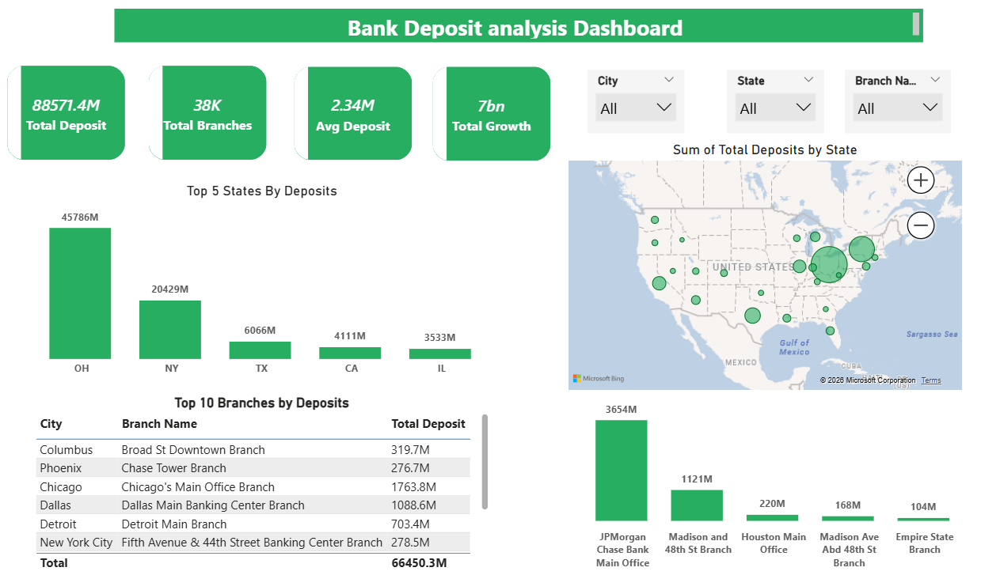

**Project Overview**

This project analyzes banking deposit data to understand growth patterns, customer behavior, and regional performance.

**🛠 Tools Used**
SQL (Data extraction & transformation)

Python (Pandas, Matplotlib for analysis)

Power BI (Dashboard & visualization)

**📈 Key Insights**
Growth is directly proportional to total deposits

High deposit regions contribute the most to overall growth

Some regions have low contribution and need attention

**📊 Dashboard Preview**

**📂 Project Files**
Banking-Deposit-dashboard.pbix → Power BI Dashboard

sql_queries.sql → SQL queries used

scatter_analysis.py → Python analysis

Images → Dashboard screenshots

**💡 Skills Demonstrated**
SQL Joins, Aggregations, Window Functions

Data Cleaning with Pandas

Data Visualization (Power BI)

Business Insight Generation

